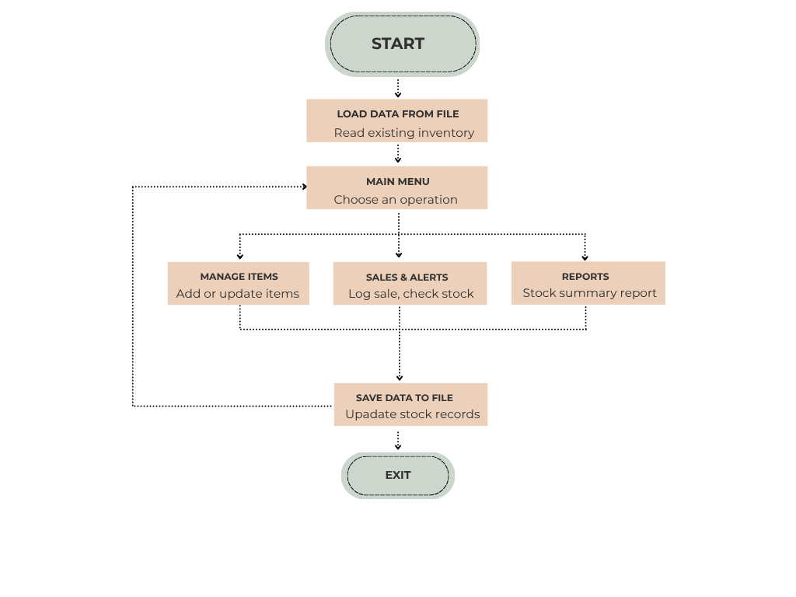

# inventory stock analysis system
Python inventory tracker with stock alerts and NumPy/Pandas reports.

# Inventory Stock Analysis System

Python-based inventory management system that tracks stock levels, records sales, generates restocking alerts, and provides item-wise summary reports — built as the Experiential Learning utility for the Python Programming Lab (N-PCCCD304P).

## Overview

The application uses a menu-driven interface to manage inventory data stored as a list of records. Each record holds an item's name, quantity, price, and reorder threshold. Core operations — adding items, updating stock, recording sales, and checking restock alerts — are implemented as separate functions. NumPy and Pandas are used to generate stock summary reports, and inventory data is saved permanently to a file so it persists between sessions.

## Installation

1. Clone the repository:
   ```
   git clone <your-repo-url>
   cd inventory-stock-analysis-system
   ```
2. Install dependencies:
   ```
   pip install numpy pandas
   ```
3. Run the application:
   ```
   python inventory_system.py
   ```

## Features

- Add and manage inventory items
- Update stock on purchase (stock in) and sale (stock out)
- Record sales transactions
- Automatic restocking alerts when stock falls below threshold
- Item-wise stock summary report using NumPy/Pandas
- Persistent storage via file handling (CSV/JSON)

## Logic Summary

The system is built around modular functions, each responsible for a single task:

| Function | Purpose |
|---|---|
| `load_data()` | Reads inventory data from file at startup |
| `save_data()` | Writes current inventory back to file |
| `add_item()` | Adds a new item to the inventory |
| `update_stock()` | Updates quantity on purchase/sale |
| `record_sale()` | Logs a sale transaction and reduces stock |
| `check_restock_alert()` | Flags items below the reorder threshold |
| `generate_summary()` | Computes stock statistics using NumPy/Pandas |
| `main()` | Displays the menu and routes user choices |

## Program Flow



## Author

Anshul — B.Tech in Computer Science and Engineering (Data Science), S.B. Jain Institute of Technology Management and Research, Nagpur

